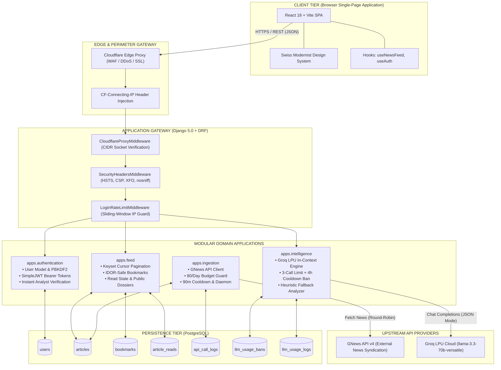
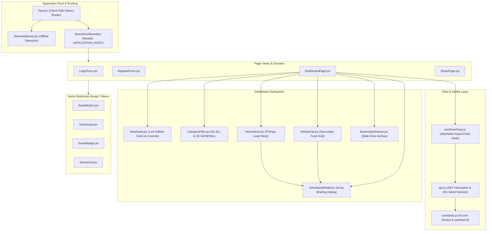
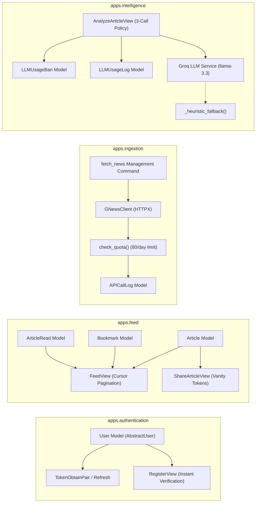
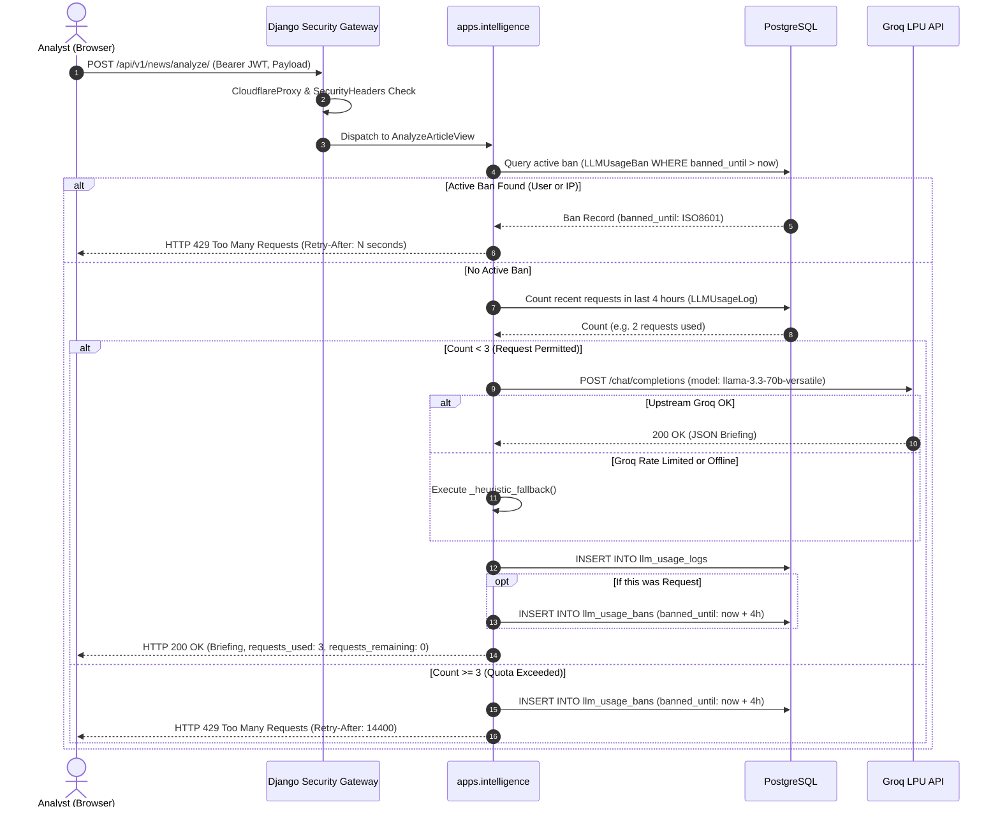

<div align="center">

# 📰 SignalReport
### Enterprise AI News Analyst & Intelligence Platform

*A high-throughput, cryptographically hardened news intelligence platform built with **Django 5.0**, **Django REST Framework**, **PostgreSQL**, **Groq LPU Intelligence**, and a **Swiss Modernist React 18** editorial interface.*

<br/>

[](https://www.python.org/)
[](https://www.djangoproject.com/)
[](https://www.django-rest-framework.org/)
[](https://groq.com/)
[](https://www.postgresql.org/)
[](https://react.dev/)
[](https://vitejs.dev/)
[](https://tailwindcss.com/)
[](LICENSE)

<br/>

[Executive Summary](#-executive-summary) •
[Full Stack Architecture](#-full-stack-architecture) •
[Frontend Architecture](#-frontend-architecture) •
[Backend Architecture](#-backend-architecture) •
[API Architecture](#-api-architecture) •
[Core Features](#-core-features) •
[Security Architecture](#-security-architecture) •
[Quickstart & Setup](#-quickstart--local-development)

</div>

---

## 📌 Executive Summary

**SignalReport** is an enterprise intelligence analyst platform designed for newsrooms, financial analysts, and institutional operators who require real-time, curated, and structured intelligence across four primary verticals: **Nation**, **Business**, **Technology**, and **General**.

Engineered under the **Lean Systems & High Modularity** philosophy, the platform eliminates unnecessary infrastructure bloat (such as external message brokers, Redis caches, or heavyweight task queues). Instead, it delivers a decoupled, four-domain Django architecture backed by PostgreSQL and powered by Groq LPU in-context artificial intelligence:

* **⚡ Clean Modular Domain Isolation**: The backend is architected into 4 focused Django apps: `authentication`, `feed`, `ingestion`, and `intelligence`.
* **🧠 Groq LPU High-Speed Synthesis**: In-context LLM analysis (`llama-3.3-70b-versatile`) producing executive takeaways, sentiment classification, key entities, and macro impact analysis in <1 second.
* **🛡️ Multi-Tier Quota & Cooldown Governance**:
  * **Groq Protection**: 3 allowed requests per user/IP before a strict 4-hour cooldown ban is enforced, with dynamic `Retry-After` headers and rule-based heuristic fallback.
  * **GNews Protection**: 80-call daily budget guard, 90-minute per-category cooldown window, and a 6-hour HTTP 429 circuit breaker.
* **🎨 Swiss International Typographic Design**: A production React 18 SPA built with pure React hooks, optimistic UI state management, crash-isolated Swiss Error Boundaries, and zero unsafe HTML injections.
* **🔒 Enterprise Defensive Security**: Cloudflare edge CIDR socket validation, sliding-window brute-force rate limiters, PBKDF2 password cryptography, and zero-trust IDOR controls.

---

## 🏛️ Full Stack Architecture

The end-to-end architecture connects the browser client, edge perimeter, application gateway, modular domain applications, external syndication and AI providers, and relational persistence.



---

## 💻 Frontend Architecture

The frontend is constructed using **React 18**, **Vite**, and **Tailwind CSS**, designed under the **Swiss International Typographic Style** (asymmetric layouts, heavy grotesque typography, 2px architectural borders, and strict contrast).



### Key Frontend Architectural Principles:
1. **Zero External State Machine Bloat**: Eliminates Redux, MobX, and Zustand. State is cleanly managed using native React 18 primitives (`useState`, `useEffect`, `useCallback`, `useRef`).
2. **Crash-Isolated Swiss Error Boundaries**: Subsystems (`IDENTITY_GATEWAY`, `INTELLIGENCE_DASHBOARD`, `SHARE_DOSSIER`) are wrapped in custom `SwissErrorBoundary` crash barriers, preventing a single component failure from cascading to the rest of the application.
3. **Pure DOM Text Nodes**: 100% of article abstracts, titles, and AI summaries are rendered as native DOM text nodes. Zero occurrences of `dangerouslySetInnerHTML`.
4. **Phishing & Scheme Sanitizer (`sanitizeUrl`)**: All outgoing hyperlinks undergo strict scheme verification (allowing only verified `http:` and `https:` protocols) and enforce `rel="noopener noreferrer"` with `target="_blank"`.
5. **Optimistic UI Updates**: Bookmarking and read-history actions toggle immediately in the UI. If the underlying network request fails, the component automatically reverts state and surfaces a contextual error notice.

---

## ⚙️ Backend Architecture

The backend is built with **Django 5.0** and **Django REST Framework (DRF)**. To ensure complete separation of concerns and maximum explainability, the codebase is partitioned into **4 decoupled modular apps**:



### Domain App Responsibilities:

| Modular Application | Primary Models | Primary Endpoints / Commands | Architectural Mandate |
| :--- | :--- | :--- | :--- |
| [**`apps.authentication`**](file:///c:/Users/skfir/Desktop/Project-1/backend/apps/authentication) | `User` | `/api/v1/auth/register`<br/>`/api/v1/auth/login`<br/>`/api/v1/auth/refresh`<br/>`/api/v1/auth/me` | Manages identity, JWT issuance, PBKDF2 password hashing, and login rate limiting. Activates users instantly with zero SMTP dependencies. |
| [**`apps.feed`**](file:///c:/Users/skfir/Desktop/Project-1/backend/apps/feed) | `Article`<br/>`Bookmark`<br/>`ArticleRead` | `/api/v1/news/feed`<br/>`/api/v1/news/bookmarks/`<br/>`/api/v1/news/reads/`<br/>`/api/v1/news/share/<token>/` | Optimized for read throughput. Provides keyset cursor pagination, IDOR-safe bookmark toggles, and public dossier vanity tokens. |
| [**`apps.ingestion`**](file:///c:/Users/skfir/Desktop/Project-1/backend/apps/ingestion) | `APICallLog` | `python manage.py fetch_news` | Manages upstream news syndication. Enforces an 80-call daily budget, 90-minute category cooldowns, and a 6-hour circuit breaker. |
| [**`apps.intelligence`**](file:///c:/Users/skfir/Desktop/Project-1/backend/apps/intelligence) | `LLMUsageBan`<br/>`LLMUsageLog` | `/api/v1/news/analyze/` | Executes in-context Groq LLM synthesis. Limits users to 3 analysis calls before enforcing a 4-hour IP and account ban. |

---

## 🔌 API Architecture

The SignalReport API follows a strict RESTful contract. All endpoints return predictable JSON payloads with standard HTTP status codes.



### Complete Endpoint Reference

#### 1. Authentication Endpoints (`/api/v1/auth/`)
| Method | Endpoint | Auth | Description |
| :--- | :--- | :--- | :--- |
| `POST` | `/api/v1/auth/register` | None | Registers an analyst account. Auto-verifies (`is_verified=True`). |
| `POST` | `/api/v1/auth/login` | None | Validates credentials and returns JWT Access & Refresh tokens. |
| `POST` | `/api/v1/auth/refresh` | None | Exchanges a valid Refresh token for a new Access token. |
| `POST` | `/api/v1/auth/logout` | JWT | Invalidates the analyst's active session. |
| `GET` | `/api/v1/auth/me` | JWT | Returns profile metadata for the authenticated analyst. |

#### 2. Editorial News & Interactions (`/api/v1/news/`)
| Method | Endpoint | Auth | Description |
| :--- | :--- | :--- | :--- |
| `GET` | `/api/v1/news/feed` | None / JWT | Returns paginated news feed filtered by category (`limit`, `cursor`). |
| `GET` | `/api/v1/news/bookmarks/` | JWT | Lists all saved bookmarks belonging to the authenticated user. |
| `POST` | `/api/v1/news/articles/<id>/bookmark/` | JWT | Toggles bookmark state for an article. |
| `DELETE`| `/api/v1/news/bookmarks/<id>/` | JWT | Removes a bookmark (IDOR protected: owner only). |
| `GET` | `/api/v1/news/reads/` | JWT | Retrieves read article history for the authenticated user. |
| `POST` | `/api/v1/news/articles/<id>/read/` | JWT | Toggles read state for an article. |
| `GET` | `/api/v1/news/share/<share_token>/` | None | Retrieves public, unauthenticated article dossier. |

#### 3. AI Intelligence (`/api/v1/news/analyze/`)
| Method | Endpoint | Auth | Description |
| :--- | :--- | :--- | :--- |
| `POST` | `/api/v1/news/analyze/` | None / JWT | Runs in-context Groq LLM synthesis. Bounded by a **3-call quota limit**, followed by a **4-hour cooldown ban**. Returns HTTP 429 when restricted. |

#### 4. Health & System
| Method | Endpoint | Auth | Description |
| :--- | :--- | :--- | :--- |
| `GET` | `/health/` | None | Operational heartbeat returning `{ "status": "healthy" }`. |

---

## 🌟 Core Features

### 1. In-Context Groq AI Synthesis
- **Model**: `llama-3.3-70b-versatile` running on Groq's high-speed LPU infrastructure.
- **Structured Briefing Output**: Produces standardized JSON with 4 distinct analytical dimensions:
  - **Market Posture**: Directional sentiment (`BULLISH`, `BEARISH`, `VOLATILE`, `NEUTRAL`) with macroeconomic rationale.
  - **Executive Takeaways**: 3–4 high-impact strategic bullet points.
  - **Strategic Impact**: Macro risk and operational implications assessment.
  - **Key Entities**: Extraction of mentioned sovereign, corporate, and regulatory entities.
- **Fail-Safe Heuristic Fallback**: If the Groq API key is unconfigured or upstream limits are reached, a rule-based engine generates immediate briefings with zero downtime.

### 2. Multi-Tier Quota & Cooldown Governance
- **Groq Protection**:
  - Each client IP and user account is allocated **3 analysis requests**.
  - Upon making the 3rd request, the system registers an `LLMUsageBan` in PostgreSQL, locking out the user/IP from AI analysis for **4 hours**.
  - Subsequent requests return `HTTP 429 Too Many Requests` with a calculated `Retry-After` header.
- **GNews Protection**:
  - Capped at **80 daily requests** (reserving 20 requests from the 100/day hard limit as a safety buffer).
  - 90-minute per-category cooldown prevents redundant requests.
  - Upstream 429 responses trigger a 6-hour pause.

### 3. Public Shareable Dossiers
- Analysts can generate public, shareable links for any news dispatch.
- Uses a 12-character cryptographic vanity token (e.g., `/share/e4a1b8c9d2f0`).
- Dossiers can be viewed by external stakeholders without an account or login barrier.

### 4. Zero-Overhead Background News Ingestion
- Standalone Django management command: `python manage.py fetch_news --daemon --interval 30`.
- Rotates across all four categories every 30 minutes, totaling **48 calls/day** (well below the 80-call budget).
- Does not require Redis, Celery, or background worker infrastructure.

---

## 🛡️ Security Architecture

SignalReport enforces a **Multi-Layered Defense-in-Depth** model:

```
[Layer 1: Edge & Network]  ──► Cloudflare IP Socket CIDR Verification
                                 │
[Layer 2: Perimeter HTTP]  ──► HSTS (31536000s) + CSP + nosniff + DENY
                                 │
[Layer 3: Brute-Force]     ──► Sliding-Window Login Rate Limiting (5 req / 60s)
                                 │
[Layer 4: Access Control]  ──► Zero-Trust IDOR Scoping (user=request.user)
                                 │
[Layer 5: AI & Quota]      ──► 4.5k-Char Prompt Bounds + 3-Call Limit + 4h Ban
                                 │
[Layer 6: DOM & Links]     ──► Pure Text DOM Nodes + rel="noopener noreferrer"
```

1. **Perimeter & Proxy Integrity (`CloudflareProxyMiddleware`)**:
   - Parses `CF-Connecting-IP` **only** when the immediate TCP socket originates from trusted Cloudflare IP ranges.
   - Drops untrusted proxy headers from public internet clients, eliminating IP spoofing attacks.

2. **HTTP Hardening (`SecurityHeadersMiddleware`)**:
   - Every outgoing response includes strict OWASP-recommended headers:
     ```http
     Strict-Transport-Security: max-age=31536000; includeSubDomains; preload
     Content-Security-Policy: default-src 'self'; frame-ancestors 'none'; object-src 'none'
     X-Frame-Options: DENY
     X-Content-Type-Options: nosniff
     Referrer-Policy: strict-origin-when-cross-origin
     ```

3. **Brute-Force Rate Limiting (`LoginRateLimitMiddleware`)**:
   - Intercepts `POST /api/v1/auth/login`.
   - Restricts clients to a maximum of 5 failed attempts per 60 seconds per IP, blocking credential stuffing.

4. **Cryptographic Authentication**:
   - Passwords hashed using Django's PBKDF2 implementation with SHA-256 (390,000 iterations).
   - Ephemeral JWT Access tokens paired with refresh rotation.

5. **Resource Bounding & Prompt Injection Defense**:
   - Article content sent to the Groq API is hard-clamped to a maximum of **4,500 characters**.
   - Mitigates prompt injection vectors and prevents token limit exhaustion.

6. **Zero-Trust IDOR Prevention**:
   - Bookmark and reading history queries are strictly scoped to the authenticated user (`filter(user=request.user)`).
   - Users cannot view, modify, or delete another user's saved data.

---

## 🚀 Quickstart & Local Development

### Prerequisites
- **Python**: 3.10, 3.11, or 3.12
- **Node.js**: 18+ and npm
- **PostgreSQL**: 15, 16, or 17

### 1. Database Setup
Create the PostgreSQL database:
```sql
CREATE DATABASE signalreport;
```

### 2. Backend Configuration & Startup
```powershell
# Navigate to backend directory
cd backend

# Create and activate virtual environment
python -m venv .venv
.\.venv\Scripts\Activate.ps1

# Install dependencies
pip install -r requirements.txt

# Run migrations
python manage.py migrate

# Start development server
python manage.py runserver 127.0.0.1:8000
```

### 3. Background News Ingestion (Daemon)
In a separate terminal window:
```powershell
cd backend
python manage.py fetch_news --daemon --interval 30
```

### 4. Frontend Configuration & Startup
In a separate terminal window:
```powershell
# Navigate to frontend directory
cd frontend

# Install dependencies
npm install

# Start Vite development server
npm run dev
```
Open **`http://localhost:5173`** in your browser.

---

## 🧪 Testing & Verification

Both the backend and frontend include automated test suites:

### Run Backend Tests (Django)
```powershell
cd backend
python manage.py test --noinput
```
*Executes 33 comprehensive unit and security tests across `authentication`, `feed`, `ingestion`, and `intelligence`.*

### Run Frontend Tests (Vitest)
```powershell
cd frontend
npm test
```
*Executes 132 tests across 25 component, integration, and security suites.*

### Run Production Build
```powershell
cd frontend
npm run build
```
*Compiles the production bundle with Vite in ~1.2 seconds.*

---

## 📄 License

This project is licensed under the Apache License 2.0. See the [LICENSE](LICENSE) file for details.
