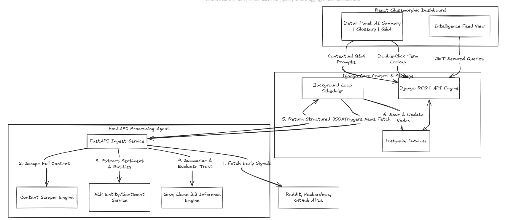

<div align="center">

# 📰 SignalReport
### Enterprise AI News Analyst Prototype

*An automated intelligence pipeline that ingests global news, extracts semantic metadata, and delivers deep AI analysis via a decoupled microservices architecture. Designed as a robust showcase of backend complexity and microservice coordination.*

> **🚀 Future Vision:** The primary goal of this project is to act as an early-alert system that fetches Tech news *before* it becomes a mainstream sensation. To achieve this, the ingestion pipeline will monitor and analyze real-time data from platforms like **Reddit**, **HackerNews**, and the **GitHub API**.

---

[](https://llama.meta.com/)
[](https://groq.com/)
[](https://www.djangoproject.com/)
[](https://fastapi.tiangolo.com/)
[](https://react.dev)
[](https://developer.mozilla.org/en-US/docs/Web/CSS)
[](https://www.postgresql.org/)

</div>

---

## 🎨 System Architecture

The project uses a decoupled, high-performance microservices architecture to offload heavy network ingestion, web-scraping, and LLM reasoning tasks from the Django application server.



---

## 🚀 Key Features

| Feature | Description |
|---|---|
| **Decoupled Architecture** | Offloads high-compute LLM inference and network-heavy web-scraping to a dedicated FastAPI microservice, ensuring the core Django server remains responsive. |
| **Early-Alert News Ingest (Future)** | An asynchronous periodic scheduler loop that scrapes, filters, and logs emerging tech trends from Reddit, HackerNews, and GitHub before they hit mainstream media. |
| **AI Enrichment Pipeline** | Processes full scraped articles to compute a **Trust Credibility Score**, extract sentiment metrics, and identify key named entities using Llama 3.3 via Groq. |
| **Double-Click Glossary** | Instantly generates contextual terminology explanations. Highlight or double-click any word/phrase in an article summary to receive an AI-generated definition. |
| **Contextual Article Q&A** | Chat directly with individual articles. Ask questions about the story, claims, or logic, with Llama 3.3 responding using the full article text as local context. |
| **Secure Token Auth** | JSON Web Token (JWT) credentials gate and authorize all dashboard operations. Automatically clears credentials and securely redirects to sign-in upon logout. |
| **Glassmorphic UI** | Premium single-page React client styled with customized Vanilla CSS, complete with loading indicators and full-screen layouts. |

---

## 🛠️ Technology Stack

* **Frontend**: React 19, Lucide Icons, Custom Glassmorphic Vanilla CSS layout.
* **Core Backend**: Django 5.0, Django REST Framework, JWT-based security middleware.
* **AI Ingestion Microservice**: FastAPI, Pydantic v2 validation, Groq API (Llama 3.3), BeautifulSoup4 scraper.
* **Database & Caching**: PostgreSQL (structured news node storage), Redis (lock-management and ingestion rate limits).

---

## 🏁 Getting Started

### Prerequisites

- Python `3.12+`
- Node.js `(Latest LTS)`
- PostgreSQL `(Running instance)`
- Redis `(Running instance or mock cache)`
- `GROQ_API_KEY` (Free key from Groq console)
- `GNEWS_API_KEY` (Free key from GNews.io)

---

### Installation & Setup

#### 1. Clone the Repository

```bash
git clone https://github.com/SHAIK-FIRDOS-01/SignalReport.git
cd SignalReport
```

#### 2. Storage Setup

Ensure PostgreSQL is running and create a database named `signalreport`. Place a `.env` configuration file in `/backend` referencing the database:
```env
DB_NAME=signalreport
DB_USER=postgres
DB_PASSWORD=postgres
DB_HOST=127.0.0.1
DB_PORT=5432
```

#### 3. Run FastAPI Ingestion Microservice

```bash
cd services/ai_ingestion
python -m venv venv
venv\Scripts\activate          # Linux/macOS: source venv/bin/activate
pip install -r requirements.txt

# Set GROQ_API_KEY and GNEWS_API_KEY in services/ai_ingestion/.env
uvicorn main:app --port 8001 --reload
```

#### 4. Run Django Core Backend

```bash
cd ../../backend
python -m venv venv
venv\Scripts\activate          # Linux/macOS: source venv/bin/activate
pip install -r requirements.txt
python manage.py migrate
python manage.py runserver
```

#### 5. Run React Frontend

```bash
cd ../frontend
npm install
npm run dev
```

---

<div align="center">

Built with 💻 by **Shaik Firdos**

</div>
